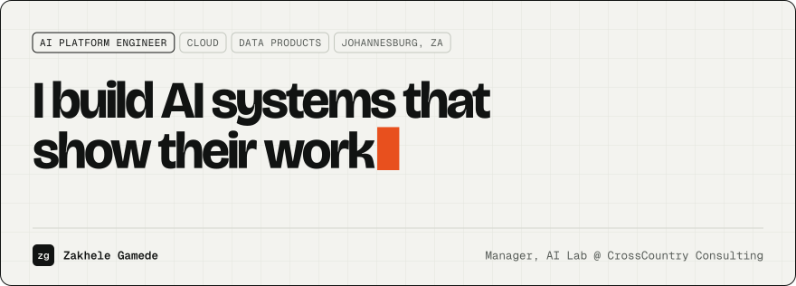
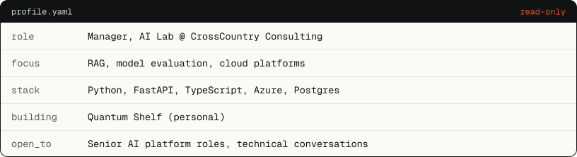
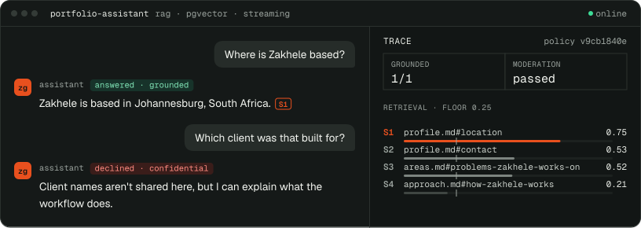
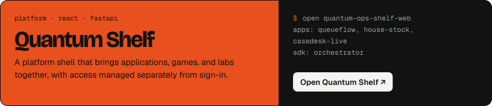

<a href="https://zakhelegamede.co.za">
  <picture>
    <source media="(prefers-color-scheme: dark)" srcset="assets/banner-dark.svg">
    
  </picture>
</a>

&nbsp;<a href="https://zakhelegamede.co.za/#ask"><picture><source media="(prefers-color-scheme: dark)" srcset="assets/btn-ask-dark.svg"></picture></a>&nbsp;<a href="mailto:hello@zakhelegamede.co.za"><picture><source media="(prefers-color-scheme: dark)" srcset="assets/btn-email-dark.svg"></picture></a>

I design and build secure, human-centred AI systems and the cloud foundations behind them, from data pipelines and model orchestration to the products people use every day.

<picture>
  <source media="(prefers-color-scheme: dark)" srcset="assets/profile-dark.svg">
  
</picture>

  

<picture>
  <source media="(prefers-color-scheme: dark)" srcset="assets/h-ask-dark.svg">
  
</picture>

A RAG assistant on my site that answers only from my documents, cites every sentence, declines with a recorded reason, and shows the trace behind each answer. [Try it on zakhelegamede.co.za](https://zakhelegamede.co.za/#ask)

 

<picture>
  <source media="(prefers-color-scheme: dark)" srcset="assets/h-work-dark.svg">
  
</picture>

Described without internal product names or proprietary details.

| Problem | Stack |
| --- | --- |
| `W-01` **Human-reviewed financial review** AI-assisted review of financial documents and transcripts; people stay responsible for decisions. | `FastAPI` `React` `Azure AI Foundry` `Microsoft Graph` |
| `W-02` **Treasury cash-flow visibility** Multiple outflow sources brought into a traceable forecast with useful planning horizons. | `Snowflake` `Python` `TypeScript` `Azure` |
| `W-03` **Reliable foundations for AI products** Architecture boundaries, event-driven audit and telemetry, secure workload identity. | `Python` `PostgreSQL` `Bicep` `Azure DevOps` |
| `W-04` **Applied AI and data engineering** AI services, retrieval systems, workflow APIs, model evaluation, analytics pipelines. | `RAG` `FastAPI` `AWS SageMaker` `Azure` |

 

<picture>
  <source media="(prefers-color-scheme: dark)" srcset="assets/h-areas-dark.svg">
  
</picture>

- **AI platform engineering:** shared foundations that AI products are built on, with clear architecture boundaries and reusable cloud infrastructure.
- **Production-grade RAG and agent workflows:** retrieval, model evaluation, and answers you can trace back to their sources.
- **Workflow automation and human-reviewed AI:** the system prepares the work, and people stay responsible for decisions.
- **Cloud foundations, identity, telemetry, and delivery:** managed identities, secure data access, infrastructure as code, and CI/CD.

 

<picture>
  <source media="(prefers-color-scheme: dark)" srcset="assets/h-products-dark.svg">
  
</picture>

Personal experiments built on my own time, kept separate from my day job, and at different stages of development: **QueueFlow**, **House Stock**, **CaseDesk Live**, and the **Orchestrator SDK**.

 

<picture>
  <source media="(prefers-color-scheme: dark)" srcset="assets/h-stack-dark.svg">
  
</picture>

**AI and backend:** `Python` `FastAPI` `RAG` `pgvector` `Azure AI Foundry` `AWS SageMaker` 
**Data:** `PostgreSQL` `Snowflake` `SQL` `pipelines` 
**Cloud:** `Azure` `Bicep` `managed identity` `Render` 
**Web and delivery:** `TypeScript` `React` `GitHub Actions` `Azure DevOps`

 

<picture>
  <source media="(prefers-color-scheme: dark)" srcset="assets/h-contact-dark.svg">
  
</picture>

For senior AI platform roles, technical conversations, or carefully scoped collaboration: [hello@zakhelegamede.co.za](mailto:hello@zakhelegamede.co.za) or [gamedevoxzakhele@gmail.com](mailto:gamedevoxzakhele@gmail.com).

 

<a href="https://zakhelegamede.co.za">
  <picture>
    <source media="(prefers-color-scheme: dark)" srcset="assets/footer-dark.svg">
    
  </picture>
</a>
